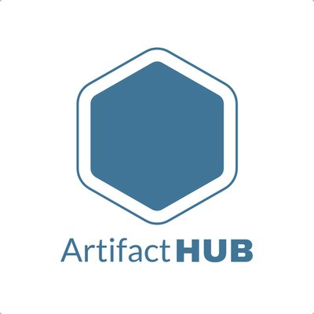
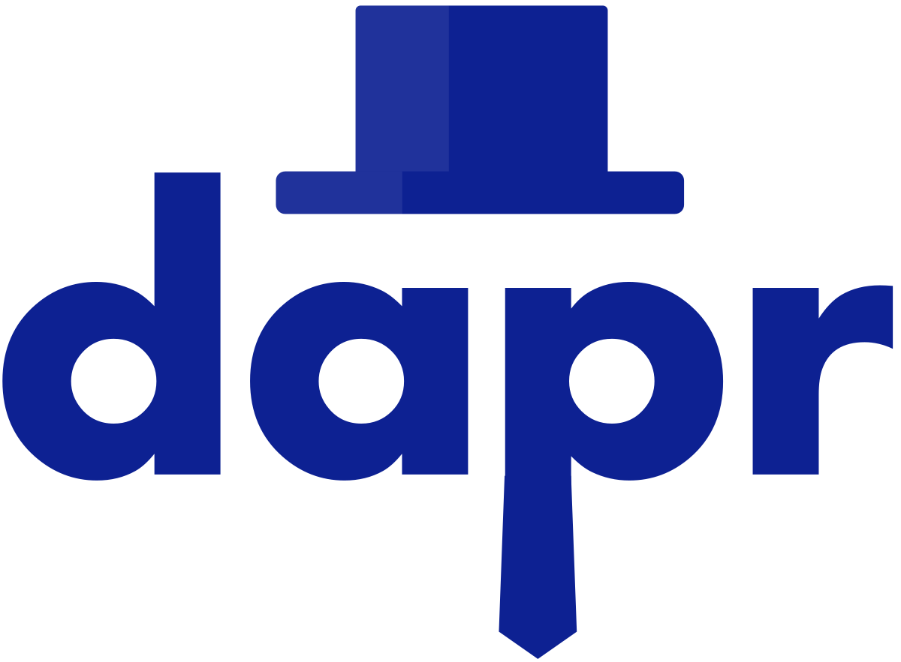
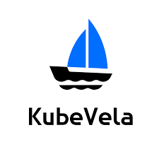
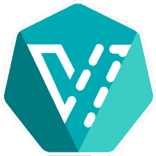

# Application Definition & Image Build (애플리케이션 정의 및 이미지 빌드)

1. **Helm** (CNCF Graduated)
2. **Artifact Hub** (CNCF Incubating)
3. **Backstage** (CNCF Incubating)
4. **Buildpacks.io** (CNCF Incubating)
5. **Dapr** (CNCF Incubating)
6. **KubeVela** (CNCF Incubating)
7. **KubeVirt** (CNCF Incubating)
8. **Operator Framework** (CNCF Incubating)
 
 

# Application Definition & Image Build (애플리케이션 정의 및 이미지 빌드)

### 1. **Helm** (CNCF Graduated)  
  

   - **설명**: Helm은 Kubernetes 애플리케이션을 정의, 설치 및 업그레이드하는 패키지 매니저입니다.  
   - **문제 해결**: Kubernetes의 복잡한 애플리케이션 배포를 간소화하고 반복 가능한 방식으로 관리할 수 있도록 돕습니다.  
   - **특징**  
     - 애플리케이션 배포의 버전 관리 및 롤백 기능 제공  
     - Chart라는 포맷을 사용해 Kubernetes 리소스들을 패키징 및 배포  
   - **사용 사례**: 여러 클러스터에서 대규모 애플리케이션 배포를 관리할 때 유용합니다.  
   - [Helm 문서](https://helm.sh/docs/)  
 

### 2. **Artifact Hub** (CNCF Incubating)

   - **설명**: Artifact Hub는 Helm 차트, OLM 번들, Falco 규칙 등 클라우드 네이티브 아티팩트를 찾고 관리할 수 있는 중앙 저장소입니다.  
   - **문제 해결**: 클라우드 네이티브 환경에서 필요한 다양한 아티팩트들을 쉽게 검색하고 관리할 수 있도록 합니다.  
   - **특징**  
     - Helm 차트 외에도 여러 종류의 아티팩트를 검색 가능  
     - 오픈 소스 및 상용 프로젝트의 아티팩트도 포함  
   - **사용 사례**: Kubernetes 애플리케이션 배포 시 필요한 다양한 자원을 한곳에서 손쉽게 찾을 수 있습니다.  
   - [Artifact Hub 문서](https://artifacthub.io/docs/)  
 

### 3. **Backstage** (CNCF Incubating)  
  

   - **설명**: Backstage는 개발자를 위한 오픈 플랫폼으로, 소프트웨어 인프라와 툴을 통합하여 효율적인 개발 환경을 제공합니다.  
   - **문제 해결**: 여러 팀이 사용하는 도구와 서비스를 한곳에서 관리할 수 없을 때의 복잡성을 해결합니다.  
   - **특징**  
     - 서비스 카탈로그, 기술 문서 및 플러그인 확장 기능 제공  
     - 개발 환경에서 사용되는 다양한 도구들을 중앙에서 관리 가능  
   - **사용 사례**: 다양한 팀과 프로젝트가 있는 대규모 조직에서 개발 툴 관리 및 통합을 필요로 할 때 유용합니다.  
   - [Backstage 문서](https://backstage.io/docs/overview/what-is-backstage)  
 

### 4. **Buildpacks.io** (CNCF Incubating)
  

   - **설명**: Buildpacks.io는 소스 코드를 자동으로 컨테이너 이미지로 변환해주는 도구입니다.  
   - **문제 해결**: 소스 코드에서 컨테이너 이미지를 생성하는 과정을 자동화하여 개발 생산성을 높입니다.  
   - **특징**  
     - 여러 언어 및 프레임워크 지원  
     - 소스 코드의 변경 사항을 감지하여 효율적으로 이미지를 빌드  
   - **사용 사례**: DevOps 파이프라인에서 소스 코드부터 컨테이너 이미지 빌드까지 자동화할 때 유용합니다.  
   - [Buildpacks.io 문서](https://buildpacks.io/docs/)  
 

### 5. **Dapr** (CNCF Incubating)  
  

   - **설명**: Dapr은 클라우드 네이티브 애플리케이션을 개발할 때 반복적인 패턴을 처리하는 분산 런타임입니다.  
   - **문제 해결**: 분산 시스템에서 흔히 발생하는 문제(서비스 간 통신, 상태 저장 등)를 표준화하여 개발을 단순화합니다.  
   - **특징**  
     - 서비스 호출, 상태 관리, 비밀 관리 등의 빌트인 기능 제공  
     - 다중 언어 및 프레임워크 지원  
   - **사용 사례**: 마이크로서비스 기반의 분산 애플리케이션을 개발할 때 유용합니다.  
   - [Dapr 문서](https://docs.dapr.io/concepts/overview/)  
 

### 6. **KubeVela** (CNCF Incubating)  
  

   - **설명**: KubeVela는 Kubernetes 기반 애플리케이션을 선언적으로 관리할 수 있는 플랫폼입니다.  
   - **문제 해결**: 복잡한 Kubernetes 배포 및 애플리케이션 관리 프로세스를 단순화합니다.  
   - **특징**
     - 선언적 애플리케이션 배포 및 관리  
     - Open Application Model(OAM)을 기반으로 개발자 친화적인 인터페이스 제공  
   - **사용 사례**: 개발자가 Kubernetes의 복잡성을 이해하지 않고도 애플리케이션을 쉽게 배포 및 관리할 수 있습니다.  
   - [KubeVela 문서](https://kubevela.io/docs/)  
 

### 7. **KubeVirt** (CNCF Incubating)  
  

   - **설명**: KubeVirt는 가상 머신(VM)을 Kubernetes 클러스터 내에서 실행할 수 있게 해주는 도구입니다.  
   - **문제 해결**: 컨테이너와 가상 머신을 동일한 클러스터에서 함께 관리할 수 있도록 합니다.
   - **특징**
     - VM과 컨테이너 워크로드를 동일한 인프라에서 실행 및 관리
     - Kubernetes의 네이티브 리소스처럼 VM을 관리 가능  
   - **사용 사례**: 레거시 애플리케이션을 컨테이너화하지 않고도 Kubernetes에서 실행해야 할 때 유용합니다.  
   - [KubeVirt 문서](https://kubevirt.io/)  
 

### 8. **Operator Framework** (CNCF Incubating)  
  

   - **설명**: Operator Framework는 Kubernetes에서 복잡한 애플리케이션을 쉽게 관리할 수 있도록 도와주는 툴셋입니다.  
   - **문제 해결**: Kubernetes에서 상태 저장 애플리케이션의 수명 주기 관리 문제를 해결합니다.  
   - **특징**  
     - 애플리케이션의 배포, 업데이트, 복구 등을 자동으로 관리  
     - 커스텀 리소스 정의(CRD) 및 컨트롤러를 사용하여 애플리케이션의 상태를 지속적으로 관리  
   - **사용 사례**: 데이터베이스나 캐시 같은 복잡한 상태 저장 애플리케이션을 Kubernetes에서 관리할 때 유용합니다.  
   - [Operator Framework 문서](https://operatorframework.io/about/)  

