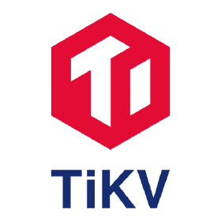
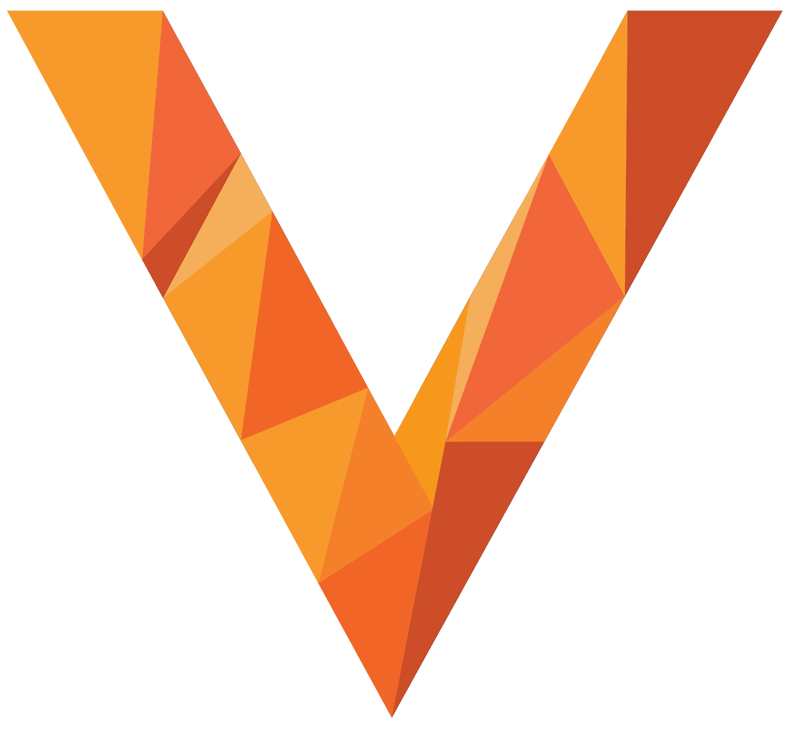

# Database (데이터베이스)  

1. **TiKV** (CNCF Graduated)
2. **Vitess** (CNCF Graduated)
 
 

# Database (데이터베이스)  

### 1. **TiKV** (CNCF Graduated)
  

   - **설명**: TiKV는 분산 트랜잭션 키-값 저장소로, 고가용성과 높은 일관성을 제공하는 오픈소스 데이터베이스입니다. 클라우드 네이티브 환경에서 대규모 데이터 처리와 스케일링에 최적화되어 있습니다.  
   - **문제 해결**: 데이터의 고가용성과 트랜잭션 일관성을 요구하는 대규모 분산 시스템에서 신뢰성 있는 키-값 저장소 솔루션을 제공합니다.  
   - **특징**  
     - 분산 트랜잭션 지원, ACID 준수  
     - 고가용성을 위한 자동 복구 및 데이터 복제  
     - 스케일링이 용이하며 수평 확장 가능  
     - Raft 프로토콜을 기반으로 데이터 복제 및 일관성 보장  
     - MySQL 및 PostgreSQL 클라이언트와의 호환성 지원  
     - 대용량 데이터 처리에 적합한 성능과 확장성 제공  
   - **사용 사례**: 대규모 트랜잭션 처리와 일관성이 요구되는 금융 서비스, 전자 상거래 플랫폼, 실시간 데이터 분석 시스템 등에서 유용합니다.     
   - [TiKV 문서](https://tikv.org/docs/7.1/new-features/overview/)  
 

### 2. **Vitess** (CNCF Graduated)
  

   - **설명**: Vitess는 MySQL 데이터베이스를 위한 수평 확장 솔루션으로, 대규모 클라우드 네이티브 환경에서 데이터베이스를 확장하고 관리할 수 있도록 설계되었습니다. 특히 Google과 같은 대규모 트래픽을 처리하는 환경에서 검증된 솔루션입니다.  
   - **문제 해결**: MySQL의 확장성 한계를 극복하며, 대규모 트래픽을 처리해야 하는 분산 시스템에서 데이터베이스 성능을 최적화합니다.  
   - **특징**  
     - 수평 확장을 지원하여 대규모 데이터베이스를 효율적으로 분산 처리  
     - Sharding(샤딩)을 통해 대용량 데이터를 자동으로 분할하여 처리  
     - 복제 및 자동 페일오버를 통해 데이터베이스의 고가용성 보장  
     - Raft 프로토콜을 기반으로 데이터 복제 및 일관성 보장  
     - 다양한 클라우드 플랫폼에서 Kubernetes와 함께 손쉽게 배포 및 관리 가능  
     - MySQL과의 완벽한 호환성을 유지하면서도 확장성과 성능을 극대화  
   - **사용 사례**: 대규모 데이터 트래픽을 처리하는 애플리케이션, 예를 들어 동영상 스트리밍 서비스, 전자 상거래 플랫폼, 소셜 네트워크 등에서 사용됩니다.     
   - [Vitess 문서](https://vitess.io/docs/21.0/overview/whatisvitess/)  
 