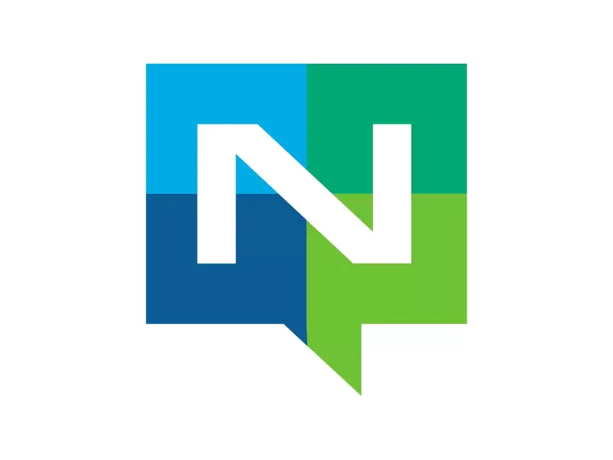
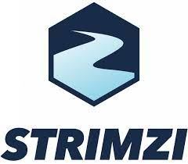

# Streaming & Messaging (스트리밍 및 메시징)

1. **CloudEvents** (CNCF Graduated)
2. **NATS** (CNCF Graduated)
3. **Strimzi** (CNCF Incubating)
 
 

# Streaming & Messaging (스트리밍 및 메시징)

### 1. **CloudEvents** (CNCF Graduated)
  

   - **설명**: CloudEvents는 클라우드 서비스 간의 이벤트 데이터를 표준화하는 스펙입니다. 이벤트 드리븐 아키텍처에서 이벤트의 데이터 형식을 통일하여 시스템 간 상호 운용성을 높입니다.  
   - **문제 해결**: 이벤트 기반 시스템 간의 데이터 표준화 문제를 해결하여, 다양한 서비스와 클라우드 간의 상호 호환성을 보장합니다.  
   - **특징**  
     - 이벤트 전송을 위한 통일된 데이터 포맷 제공  
     - REST, HTTP, Kafka, MQTT 등 다양한 프로토콜 지원  
     - 클라우드 네이티브 환경에서 발생하는 이벤트 간의 일관된 구조 보장  
   - **사용 사례**: 이벤트 기반 마이크로서비스 아키텍처에서 여러 클라우드 및 서비스 간의 통신을 표준화할 때 유용합니다.   
   - [CloudEvents 문서](https://cloudevents.io/)  
 

### 2. **NATS** (CNCF Graduated)
  

   - **설명**: NATS는 고성능의 메시징 시스템으로, 실시간 애플리케이션과 서비스 간 통신을 지원합니다. 매우 가볍고 빠른 메시징 솔루션으로서 분산 시스템에서 사용됩니다.  
   - **문제 해결**: 대규모 분산 시스템에서 낮은 지연 시간과 높은 처리량을 요구하는 실시간 메시징 문제를 해결합니다.  
   - **특징**  
     - 낮은 지연 시간과 높은 성능을 제공하는 메시징 시스템  
     - 간단한 API로 빠르게 통합 가능  
     - Publish&Subscribe 패턴, 요청/응답 패턴 지원 (메시지 큐에 구독자를 등록하면 클라이언트에서 보낸 하나의 메시지가 등록된 모든 구독자에게 전달이 되어서 처리) -> 1:N 관계의 비동기 처리를 구현하고자 할 때 사용  
     - JetStream을 통한 지속성 지원, Key/Value 데이터 구조 지원 (버전 관리, TTL, Watchers 기능 포함)  
     - Object Storage 버전 관리 기능 포함  
   - **사용 사례**: 고성능 메시징이 필요한 실시간 애플리케이션 및 마이크로서비스 간의 통신에서 사용됩니다.   
   - [NATS 문서](https://docs.nats.io/)  
 

### 3. **Strimzi** (CNCF Incubating)
  

   - **설명**: Strimzi는 Kubernetes에서 Apache Kafka를 쉽게 실행하고 관리할 수 있도록 지원하는 오픈소스 프로젝트입니다. Kafka 클러스터를 Kubernetes 환경에 맞춰 자동으로 설치, 관리, 확장할 수 있게 합니다.  
   - **문제 해결**: Kubernetes 클러스터에서 Apache Kafka를 효율적으로 배포하고 관리하는 복잡성을 해결하며, 데이터 스트리밍 애플리케이션의 배포 및 운영을 간소화합니다.  
   - **특징**  
     - Kubernetes 네이티브 방식으로 Kafka 클러스터를 설치, 구성, 관리 가능  
     - Kafka 클러스터의 자동화된 스케일링, 업데이트 및 롤링 리스타트 지원 
     - Kubernetes 리소스(예: StatefulSets, ConfigMaps)를 활용하여 Kafka 클러스터 관리  
     - Kafka 브로커, Zookeeper, Kafka Connect 등 다양한 Kafka 구성 요소에 대한 지원  
     - 보안 기능 제공 (TLS, OAuth 2.0, 인증 및 권한 부여)  
     - 클러스터 모니터링 및 경고 기능 제공  
   - **사용 사례**: Strimzi는 대규모 데이터 스트리밍 플랫폼을 Kubernetes에서 쉽게 관리하고, Apache Kafka를 사용해 분산 시스템의 실시간 데이터를 처리해야 하는 환경에 적합합니다. 운영자는 Kafka 클러스터의 배포 및 관리 작업을 자동화하여 운영 부담을 줄일 수 있습니다.   
   - [Strimzi 문서](https://strimzi.io/documentation/)  
 