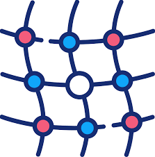

# Observability
1. **Chaos Mesh** (CNCF Graduated)
 

### 1. **Chaos Mesh** (CNCF Graduated)  
  

   - **설명**: Chaos Mesh는 오픈소스 Cloud Native Chaos Enginerring 플랫폼입니다. 다양한 유형의 결함(fault) 시뮬레이션을 제공하며 결함 시나리오를 조율하는 기능을 갖고 있습니다. 
   - **문제 해결**: 예상치 못한 장애 대응 능력 향상, 서비스 복원력 검증에 사용되며, Kubernetes 기반 환경에서 테스트하는 것에 최적화되어 있습니다. 
   - **특징**  
     - 카오스 실험 시나리오 정의: 다양한 실험을 정의하고, 네트워크 지연, 리소스 부족, 파드 또는 노드 장애 등 여러 카오스 상태를 쉽게 시뮬레이션 가능 
     - Kubernetes 네이티브: Kubernetes 환경에서 네이티브하게 동작하며, 클러스터 자원을 대상으로 실험을 자동화 가능 
     - 사용자 친화적 인터페이스: 웹 UI에서 Chaos 시나리오를 쉽게 설계하고 Chaos 실험의 상태를 모니터링 가능 
     - 관찰가능성 통합 : Prometheus, Grafana 등과 같은 모니터링 툴과 통합되어 실험 결과를 실시간으로 시각화하고 분석 가능 
   - **사용 사례**: Chaos Mesh는 프로덕션 환경의 안정성 테스트, 애플리케이션 성능 검증에 사용되며 특히 Kubernetes 클러스터에서 실행 중인 컨테이너화된 애플리케이션 테스트에 사용할 수 있습니다. 
   - [Chaos Mesh 문서](https://chaos-mesh.org/)
