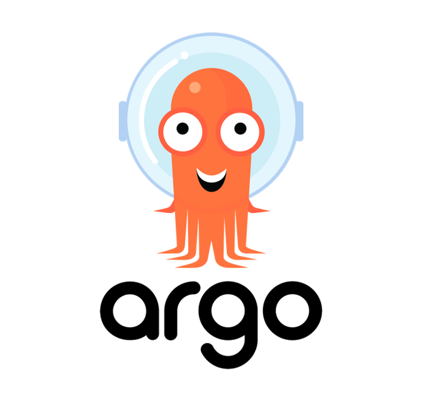
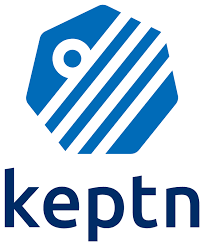
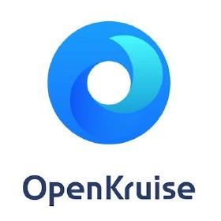

# Continuous Integration & Delivery
1. **Argo** (CNCF Graduated)
2. **Flux** (CNCF Graduated)
3. **Keptn** (CNCF Incubating)
4. **OpenKruise** (CNCF Incubating)
 

### 1. **Argo** (CNCF Graduated)  
  

   - **설명**: Argo는 Kubernetes 환경에서의 워크플로우 자동화를 위한 도구입니다. CI/CD 파이프라인을 구축하고 관리하는 데 사용됩니다.  
   - **문제 해결**: Kubernetes에서의 복잡한 애플리케이션 배포 및 자동화를 단순화하고, 컨테이너화된 애플리케이션의 지속적 통합과 배포를 효율적으로 관리할 수 있습니다.  
   - **특징**  
     - Argo CD, Argo Workflows, Argo Rollouts 등의 하위 프로젝트가 있으며, 다양한 배포 전략을 지원  
     - Kubernetes 네이티브 방식으로 선언적 GitOps 스타일의 배포를 수행  
     - 복잡한 워크플로우를 시각화하고 관리할 수 있는 기능 제공  
   - **사용 사례**: 복잡한 마이크로서비스 아키텍처에서 여러 애플리케이션을 Kubernetes에 효율적으로 배포 및 관리할 때 유용합니다.  
   - [Argo 문서](https://argo-workflows.readthedocs.io/en/latest/)  

### 2. **Flux** (CNCF Graduated)  
  

   - **설명**: Flux는 GitOps 기반의 지속적 배포 도구로, Kubernetes 클러스터에서의 애플리케이션 업데이트를 자동화합니다.  
   - **문제 해결**: Kubernetes 클러스터에서 선언적 방식으로 애플리케이션 배포를 자동화하고, Git 저장소와 클러스터 상태를 동기화합니다.  
   - **특징**  
     - Git 저장소를 단일 소스로 사용하여 배포 및 관리  
     - Kubernetes 애플리케이션의 상태를 지속적으로 모니터링하고 자동으로 업데이트  
     - Helm 차트 및 Kustomize와의 통합 지원  
   - **사용 사례**: 지속적으로 애플리케이션을 배포해야 하는 환경에서 GitOps 방식을 사용하여 쉽게 배포 및 관리를 할 수 있습니다.  
   - [flux 문서](https://fluxcd.io/flux/)  

### 3. **Keptn** (CNCF Incubating)  
  

   - **설명**: Keptn은 클라우드 네이티브 환경에서 서비스 배포, 테스트 및 운영을 자동화하는 도구입니다.  
   - **문제 해결**: 여러 단계의 배포 과정에서 성능, 품질 및 안정성을 보장하며, 자동화된 피드백 루프를 통해 지속적 배포와 운영을 개선합니다.  
   - **특징**  
     - SLO(Service Level Objective) 기반의 배포 및 모니터링  
     - 다양한 CI/CD 도구와의 통합을 통해 배포와 테스트 자동화 지원  
     - 이벤트 기반의 자동화 파이프라인 구성  
   - **사용 사례**: 대규모 애플리케이션 배포 및 모니터링이 필요할 때, SLO를 기반으로 성능을 보장하면서 운영 자동화를 구현할 수 있습니다.  
   - [keptn 문서](https://keptn.sh/stable/docs/)  

   ### 4. **OpenKruise** (CNCF Incubating)  
  

   - **설명**: OpenKruise는 Kubernetes 네이티브 애플리케이션 관리를 위한 확장된 워크로드 기능을 제공하는 도구입니다.  
   - **문제 해결**: Kubernetes에서 기본적으로 제공하지 않는 고급 워크로드 관리 기능을 추가로 제공하여 애플리케이션을 더욱 유연하게 관리할 수 있습니다.  
   - **특징**  
     - 기본 Kubernetes 워크로드보다 확장된 배포 전략 지원  
     - 고급 롤링 업데이트, 클론 셋, 컨테이너 리스타트 등의 기능 제공  
     - 리소스 오케스트레이션 및 최적화된 배포 기능 지원  
   - **사용 사례**: 더 복잡하고 세부적인 Kubernetes 애플리케이션 배포 및 관리가 필요할 때 유용합니다.  
   - [openkruise 문서](https://openkruise.io/)  