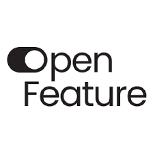

# Feature Flagging
1. **OpenFeature** (CNCF Incubating)

 

### 1. **OpenFeature** (CNCF Incubating)  
  

   - **설명**: 서드 파티 Flagging 공급자에 플러그인할 수 있는 표준화된 Feature Flagging 클라이언트인 SDK를 제공합니다. 오픈소스/상용, 자체호스팅/클라우드 상관없이 OpenFeature는 개발자가 애플리케이션에서 Feature Flagging을 사용할 수 있도록 일관되고 통합된 API를 제공합니다. 
   - **문제 해결**: 다양한 Feature Flagging 공급자의 호환성을 제공하여 벤더 종속성을 줄이고, 새로운 기능을 점진적으로 배포/특정 사용자에게만 배포하여 배포 속도와 안정성을 개선합니다. 
   - **특징**  
     - 표준 API: 모든 기능 플래그 시스템을 위한 공통 API를 제공해, 다양한 벤더 솔루션과의 상호운용성을 높임
     - SDK 지원: 여러 언어 및 환경을 위한 SDK를 제공하여 다양한 애플리케이션에서 기능 플래그를 쉽게 적용 가능 
     - 확장성: 플러그인 시스템을 통해 다양한 기능 플래그 제공업체와 통합할 수 있으며, 이를 통해 벤더 종속성을 줄이고 유연성을 제공
     - 관찰 가능성: OpenFeature는 기능 플래그의 상태와 결과를 모니터링할 수 있는 관찰 가능성 기능을 내장하여, 플래그의 성능과 영향도를 추적 가능 
   - **사용 사례**: OpenFeature는 점진적 기능 릴리스, A/B 테스트 등에 사용되며 멀티 클라우드 환경에서도 Feature flag를 일관되게 관리할 수 있습니다. 
   - [OpenFeature 문서](https://openfeature.dev/docs/reference/intro/)