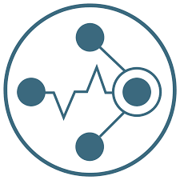

# Observability
1. **Fluentd** (CNCF Graduated)
2. **Jaeger** (CNCF Graduated)
3. **Prometheus** (CNCF Graduated)
4. **Cortex** (CNCF Incubating)

 

### 1. **Fluentd** (CNCF Graduated)  
  

   - **설명**: Fluentd는 오픈 소스 데이터 수집기로, 데이터 collection과 consumption를 통합하여 데이터를 보다 잘 활용할 수 있게 해줍니다. 보통 로그 수집기로 쓰이며,  로그 데이터를 통합하고, 변환하고, 전송하는 작업을 쉽게 처리할 수 있습니다. 
   - **문제 해결**: 다양한 소스의 데이터 통합, 데이터 형식 문제 해결, 실시간 데이터 파이프라인에 사용됩니다.  
   - **특징**  
     - Json을 사용한 통합 로깅 : 가능한 한 Json으로 데이터 구조화하여 로그 데이터 처리의 모든 측면을 통합
     - pluggable Architecture : 기능을 확장할 수 있는 유연한 플러그인 시스템을 갖춤
     - 필요 리소스 최소화 : C 언어 + Duby를 조합하여 작성되었으며, 시스템 리소스가 거의 필요하지 않음.
     - 내장된 신뢰성 : 노드 간 데이터 손실을 방지하기 위해 메모리 및 파일 기반 버퍼링 지원, 강력한 장애 조치, 고가용성 설정 가능
   - **사용 사례**: Fluentd는 대규모 로그 관리 및 분석 환경에서 특히 유용하며, 클라우드 및 멀티 클라우드 데이터 통합, 데이터 파이프라인으로 널리 사용됩니다. 
   - [fluentd 문서](https://www.fluentd.org/architecture)

### 2. **Jaeger** (CNCF Graduated)  
  

   - **설명**: Jaeger는 오픈소스 분산 추적 플랫폼으로 마이크로서비스 기반 애플리케이션의 성능 및 트랜잭션 분석을 위해 설계되었습니다. 특히, 트랜잭션의 흐름을 시각적으로 추적하고, 병목 현상과 같은 성능 문제를 해결하는 데 유용합니다.
   - **문제 해결**: Jaeger는 분산 워크플로 모니터링, 성능 병목 현상 식별, 근본 원인 추적, 서비스 종속성 분석에 사용됩니다. 
   - **특징**  
     - 분산 트랜잭션 추적 : Jaeger는 분산 시스템의 트랜잭션을 추적하여, 서비스 간 요청 흐름을 시각적으로 파악
     - 성능 최적화 : 서비스 호출 간의 지연 시간, 병목 구간 등을 시각화하여 성능 문제를 진단하고 최적화
     - 애플리케이션 의존성 분석 : 마이크로서비스 간의 의존 관계를 분석하고, 트랜잭션이 실패하거나 성능이 저하되는 구간을 쉽게 확인
     - 실시간 모니터링 : Jaeger는 애플리케이션의 실시간 트레이스를 제공하여, 요청이 어느 서비스에서 처리되는지 바로 확인
   - **사용 사례**: Jaeger는 마이크로서비스 기반 애플리케이션의 성능 분석, 애플리케이션 의존성 시각화, 분산 시스템의 오류 추적 등에 사용되며 CI/CD에 통합하여 배포 후 성능 모니터링 및 실시간 트레이브 분석을 지원할 수 있습니다.
   - [Jaeger 문서](https://www.jaegertracing.io/docs/1.61/)

### 3. **Prometheus** (CNCF Graduated)  
  

   - **설명**: Prometheus는 오픈소스 모니터링 및 경고 Toolkit으로 , 주로 시계열 데이터 수집과 알림을 위한 목적으로 사용됩니다. 클라우드 네이티브 환경에서의 시스템 및 애플리케이션 성능 모니터링에 최적화되어 있습니다.
   - **문제 해결**: 서버, 애플리케이션, 컨테이너 등 실시간 리소스 모니터링, 자동화된 경고 발생, 서비스 가용성 확인에 도움을 줍니다.
   - **특징**  
     - 시계열 데이터베이스: Prometheus는 시계열 데이터(time-series data)를 수집 및 저장하며, 각 데이터 포인트는 타임스탬프가 기록 
     - 강력한 쿼리 언어: PromQL(Prometheus Query Language)을 사용하여 수집된 데이터를 효율적으로 분석하고 시각화 
     - 다양한 메트릭 수집: 애플리케이션, 서버, 컨테이너 등 다양한 소스에서 메트릭(metric)을 수집
     - 푸시 대신 풀 방식: Prometheus는 푸시 방식이 아닌 풀(Pull) 방식으로 타겟에서 메트릭을 주기적으로 스크래핑하여 데이터를 수집
     - 알림 관리: Alertmanager와 통합하여 임계값에 도달했을 때 경고 메시지를 발송 가능 
     - 수평 확장 및 고가용성: Prometheus는 수평 확장 및 고가용성을 지원하는 분산 시스템 모니터링이 목표
   - **사용 사례**: Prometheus는 Kubernetes와 같은 클라우드 네이티브 환경에서 리소스 사용량을 모니터링하거나 메트릭 수집에 사용되며, alertmanager를 통해 임계값 기반 경고를 설정하고 Slack과 같은 채널로 경고를 전송할 수 있습니다.
   - [Prometheus 문서](https://prometheus.io/docs/introduction/overview/)

### 4. **Cortex** (CNCF Incubating)  
  

   - **설명**: Cortex는 Prometheus를 위한 수평 확장성, 고가용성, 다중 테넌트, 장기 스토리지 입니다.
   - **문제 해결**: Prometheus의 여러 문제를 해결하기 위해 설계되어, Prometheus의 확장성, 단기 데이터 문제 해결에 도움을 줍니다.
   - **특징**  
     - 수평적 확장성 : Cortex는 클러스터의 여러 머신에서 실행될 수 있어 단일 머신의 처리량과 저장 용량을 능가
     - 높은 가용성 : 클러스터에서 실행하는 경우 Cortex는 머신 간에 데이터를 복제 가능
     - 멀티 테넌트 : Cortex는 단일 클러스터에서 여러 개의 서로 다른 독립적인 Prometheus 소스의 데이터와 쿼리를 분리 가능
     - 장기 저장 : Cortex는 메트릭 데이터의 장기 저장을 위해 S3, GCS, Swift 및 Microsoft Azure를 지원
   - **사용 사례**: Cortex는 수백 개 이상의 prometheus 서버가 필요한 대규모 모니터링 시스템이나 멀티 테넌트 환경 모니터링, 장기적인 모니터링 시 데이터 저장에 사용되며 kubernetes 환경에 최적화되어 있습니다. 
   - [Cortex 문서](https://cortexmetrics.io/docs/)