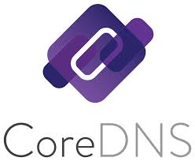
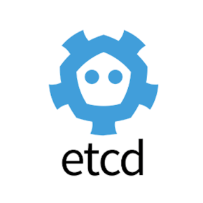

# Coordination & Service Discovery  

1. **CoreDNS** (CNCF Graduated)
2. **etcd** (CNCF Graduated)

 
 

# Coordination & Service Discovery    

### 1. **CoreDNS** (CNCF Graduated)  
  

   - **설명**: CoreDNS는 클라우드 네이티브 환경에서 서비스 디스커버리를 위한 오픈소스 DNS 서버로, 특히 Kubernetes 클러스터에서 서비스 디스커버리와 네임서버 구성을 쉽게 처리하는 플러그인 기반의 유연한 DNS 서버입니다.  
   - **문제 해결**: Kubernetes 클러스터 내에서 서비스 디스커버리 및 네임서버 구성의 복잡성을 줄이고, 확장 가능한 DNS 솔루션을 제공하여 트래픽을 효율적으로 라우팅할 수 있도록 돕습니다.  
   - **특징**  
     - 플러그인 기반 아키텍처: 다양한 기능을 플러그인 형태로 추가할 수 있어 DNS 서버를 유연하게 구성 및 확장 가능  
     - Kubernetes 네이티브 통합: Kubernetes 환경에서 네임스페이스와 서비스를 관리하고, 클러스터 내부 서비스 디스커버리를 쉽게 처리  
     - 고성능 및 확장성: 다중 코어 지원과 간단한 설정으로 고성능을 제공하며, 대규모 클러스터 환경에서도 안정적으로 확장성 유지  
   - **사용 사례**: CoreDNS는 Kubernetes 클러스터에서 서비스 디스커버리, 네트워크 트래픽 관리, 그리고 DNS 기반 라우팅을 간편하게 설정하고 관리하는 데 사용됩니다.  
   - [CoreDNS 문서](https://coredns.io/manual/toc/)  
 

### 2. **etcd** (CNCF Graduated)  
  

   - **설명**: etcd는 분산 키-값 저장소로, 특히 Kubernetes 클러스터와 같은 분산 시스템에서 설정 정보와 메타데이터를 저장하고 동기화하는 데 사용됩니다. Kubernetes의 핵심 데이터 저장소 역할을 하며, 고가용성과 데이터 일관성을 보장합니다.  
   - **문제 해결**: 분산 시스템에서 데이터 일관성과 고가용성을 유지하면서, 클러스터 내에서 설정 정보를 동기화하고 저장하는 복잡성을 해결합니다.  
   - **특징**  
     - 강력한 일관성 보장: Raft 알고리즘을 사용해 분산된 시스템 내에서 데이터의 일관성을 유지하며, 모든 클러스터 멤버가 동일한 상태를 공유  
     - 고가용성: 데이터는 여러 노드에 복제되어 장애 발생 시에도 빠른 복구가 가능하고, 안정적인 데이터 접근을 보장  
     - Kubernetes 필수 구성 요소: Kubernetes의 핵심 데이터 저장소로, 클러스터의 모든 상태와 설정 정보를 관리  
   - **사용 사례**: etcd는 Kubernetes 클러스터에서 설정 정보, 서비스 레지스트리, 메타데이터 저장소 등 분산 시스템에서의 중요한 역할을 하며, 데이터 일관성을 요구하는 다양한 시스템에서 활용됩니다.  
   - [etcd 문서](https://etcd.io/docs/v3.5/)  
 