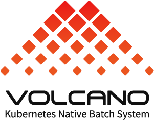

# Scheduling & Orchestration (스케줄링 및 오케스트레이션)

1. **Kubernetes** (CNCF Graduated)
2. **Crossplane** (CNCF Incubating)
3. **Karmada** (CNCF Incubating)
4. **Knative** (CNCF Incubating)
5. **Volcano** (CNCF Incubating)

 
 

# Scheduling & Orchestration (스케줄링 및 오케스트레이션)  

### 1. **Kubernetes** (CNCF Graduated)  
  

   - **설명**: Kubernetes는 컨테이너화된 애플리케이션을 자동으로 배포, 관리, 스케일링하는 오픈소스 플랫폼으로, 클라우드 네이티브 인프라의 핵심적인 역할을 합니다.  
   - **문제 해결**: 컨테이너 기반 애플리케이션의 복잡한 배포와 스케일링, 그리고 관리의 어려움을 해결합니다.  
   - **특징**  
     - 자동 스케일링 및 배포: 애플리케이션의 트래픽 증가에 따라 자동으로 리소스를 할당하고 스케일링  
     - 자체 복구 기능: 컨테이너나 노드의 장애 발생 시 자동으로 재배포 및 복구 수행  
     - 광범위한 확장성 및 모듈성: 수평 확장, 다양한 플러그인 및 확장 도구 지원  
   - **사용 사례**: 클라우드 네이티브 애플리케이션 관리, 마이크로서비스 아키텍처, 그리고 대규모 애플리케이션 배포 환경에서 사용됩니다.  
   - [Kubernetes 문서](https://kubernetes.io/docs/home/)  
 

### 2. **Crossplane** (CNCF Incubating)  
  

   - **설명**: Crossplane은 Kubernetes에서 인프라를 관리하는 오픈소스 프로젝트로, 클라우드 및 온프레미스 리소스를 Kubernetes API를 통해 관리할 수 있게 합니다.  
   - **문제 해결**: 클라우드 네이티브 환경에서 인프라 관리를 통합하고, 개발자가 익숙한 Kubernetes API로 인프라와 애플리케이션을 함께 관리할 수 있도록 합니다.  
   - **특징**  
     - Kubernetes 네이티브 인프라 관리: 클라우드 리소스(예: AWS, GCP, Azure)를 Kubernetes CRD(Custom Resource Definition)로 관리  
     - 멀티 클라우드 및 하이브리드 클라우드 지원: 하나의 Kubernetes API로 여러 클라우드 플랫폼을 관리  
     - 애플리케이션과 인프라의 통합: 인프라와 애플리케이션을 동일한 방식으로 선언적 관리  
   - **사용 사례**: 클라우드 인프라 통합 관리, DevOps 환경에서 인프라와 애플리케이션을 동시에 관리하고자 하는 경우, 그리고 하이브리드 및 멀티 클라우드 환경에서의 복잡한 인프라 관리를 간소화할 때 유용합니다.  
   - [Crossplane 문서](https://docs.crossplane.io/latest/)  
 

### 3. **Karmada** (CNCF Incubating)  
  

   - **설명**: Karmada는 Kubernetes 기반의 멀티 클러스터 관리를 위한 오픈소스 프로젝트로, 여러 Kubernetes 클러스터를 중앙에서 통합 관리할 수 있게 해줍니다.  
   - **문제 해결**: 멀티 클러스터 환경에서 중앙화된 관리와 애플리케이션의 글로벌 배포 문제를 해결합니다.  
   - **특징**  
     - Kubernetes-native API 호환성: 기존 Kubernetes 클러스터와 도구 체인에 원활하게 통합되며, 단일 클러스터에서 멀티 클러스터로 무변경 업그레이드를 지원  
     - 멀티 클러스터 자동화: 클러스터 간 자동 스케일링, 페일오버, 로드 밸런싱을 지원하며, 다양한 시나리오(예: 액티브-액티브, 재해 복구 등)에 대한 빌트인 정책 제공  
     - 중앙화된 멀티 클러스터 관리: 퍼블릭 클라우드, 온프레미스, 엣지 환경의 클러스터를 중앙에서 관리하며, 위치에 구애받지 않는 클러스터 관리와 다차원 고가용성 정책(리전, 가용영역, 클러스터, 프로바이더 간)을 제공  
   - **사용 사례**: Karmada는 여러 클라우드와 클러스터에서 애플리케이션을 통합적으로 관리해야 하는 멀티 클러스터 환경에서 유용합니다.   
   - [Karmada 문서](https://karmada.io/docs/)
   )  
 

### 4. **Knative** (CNCF Incubating)  
  

   - **설명**: Knative는 Kubernetes 위에서 서버리스 워크로드를 쉽게 배포하고 관리할 수 있도록 설계된 오픈소스 플랫폼입니다. 서버리스 애플리케이션의 개발과 관리를 간소화합니다.  
   - **문제 해결**: 서버리스 애플리케이션의 배포, 스케일링 및 관리를 간소화하여 서버 관리의 복잡성을 줄입니다.  
   - **특징**  
     - 자동 스케일링: 트래픽에 따라 서버리스 애플리케이션을 자동으로 확장하거나 축소하여 리소스를 효율적으로 관리하고, 필요하지 않은 리소스는 자동으로 축소해 비용 절감  
     - 이벤트 기반 애플리케이션: Knative Eventing을 통해 다양한 이벤트 소스에서 이벤트를 받아 처리하며, 이벤트 기반 마이크로서비스 아키텍처를 쉽게 구축 가능, CloudEvents 표준을 준수해 이벤트를 처리  
     - Kubernetes 통합: Knative Serving과 Eventing을 사용해 서버리스 애플리케이션을 Kubernetes 클러스터에서 관리할 수 있으며, 기존 Kubernetes API 및 도구와 완벽하게 호환  
   - **사용 사례**: Knative는 서버리스 애플리케이션 개발 및 배포에 적합하며, 특히 이벤트 기반 아키텍처나 트래픽이 비정기적인 워크로드에서 자동으로 리소스를 최적화하는 환경에 유용합니다. 이벤트 주도형 마이크로서비스, 트래픽 변화가 큰 웹 애플리케이션, 백엔드 프로세싱 워크로드 등에 효과적입니다.   
   - [Knative 문서](https://knative.dev/docs/concepts/#knative-serving)
   )  
 

### 5. **Volcano** (CNCF Incubating)  
  

   - **설명**: Volcano는 Kubernetes 상에서 고성능 컴퓨팅(HPC) 워크로드를 관리하고 스케줄링하는 오픈소스 프로젝트입니다. HPC 애플리케이션을 최적화하여 실행할 수 있도록 설계되었습니다.  
   - **문제 해결**: 데이터 과학, 머신러닝, 고성능 컴퓨팅 워크로드를 Kubernetes에서 관리할 때의 스케줄링 복잡성을 해결합니다.  
   - **특징**  
     - 고성능 컴퓨팅 스케줄링 최적화: 병렬 작업, 대용량 데이터 계산 작업을 효율적으로 스케줄링하며, 다양한 컴퓨팅 프레임워크(Spark, TensorFlow, PyTorch 등)를 지원  
     - 이벤트 기반 애플리케이션: Knative Eventing을 통해 다양한 이벤트 소스에서 이벤트를 받아 처리하며, 이벤트 기반 마이크로서비스 아키텍처를 쉽게 구축 가능, CloudEvents 표준을 준수해 이벤트를 처리  
     - 다양한 스케줄링 정책 지원: Gang 스케줄링, Fair-share, Queue 스케줄링, Preemption 등 다양한 스케줄링 정책을 지원하여 유연하게 워크로드를 관리 가능  
   - **사용 사례**: Volcano는 머신러닝, 데이터 과학, 금융 모델링, 유전자 분석 등 고성능 컴퓨팅을 필요로 하는 작업에 적합하며, Kubernetes 환경에서의 복잡한 배치 작업 스케줄링을 효율적으로 처리합니다.   
   - [Volcano 문서](https://volcano.sh/en/docs/)
   )  
 