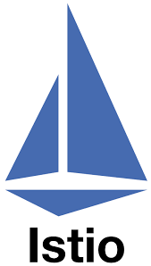

# Service Mesh 
 

1. **Istio** (CNCF Graduated)
2. **Linkerd** (CNCF Graduated)

 
 

# Service Mesh      

### 1. **gRPC** (CNCF Graduated)  
  

   - **설명**: gRPC는 Google이 개발한 고성능 오픈소스 원격 프로시저 호출(RPC) 프레임워크로, 클라이언트와 서버 간의 통신을 쉽게 구현할 수 있도록 설계되었습니다. gRPC는 HTTP/2를 기반으로 하며, 스트리밍과 양방향 통신을 지원하는 프로토콜입니다.  
   - **문제 해결**: 마이크로서비스 아키텍처에서 클라이언트와 서버 간의 복잡한 통신 문제를 해결하고, HTTP/2를 통해 빠르고 효율적인 통신을 가능하게 합니다. 또한, 다양한 프로그래밍 언어를 지원해 여러 환경에서 일관된 통신을 제공합니다.  
   - **특징**  
     - HTTP/2 기반 통신: gRPC는 HTTP/2를 기반으로 하여 멀티플렉싱, 흐름 제어, 헤더 압축 등을 지원하며, 효율적인 양방향 스트리밍 통신을 제공  
     - 다양한 언어 지원: gRPC는 C++, Java, Python, Go 등 여러 프로그래밍 언어를 지원하여 다양한 플랫폼과 환경에서 일관된 통신 인터페이스를 제공  
     - 프로토콜 버퍼 사용: gRPC는 데이터 직렬화를 위해 Google의 Protocol Buffers(proto)를 사용하여 효율적이고 빠른 데이터 전송이 가능  
   - **사용 사례**: gRPC는 마이크로서비스 아키텍처, 분산 시스템, 실시간 데이터 스트리밍, IoT 애플리케이션 등에서 클라이언트와 서버 간의 고성능 통신을 구현하는 데 사용됩니다. 또한, 다양한 프로그래밍 언어를 사용하는 환경에서 일관된 통신 방법을 제공하는 데 유용합니다.  
   - [gRPC 문서](https://grpc.io/docs/what-is-grpc/introduction/)  
 