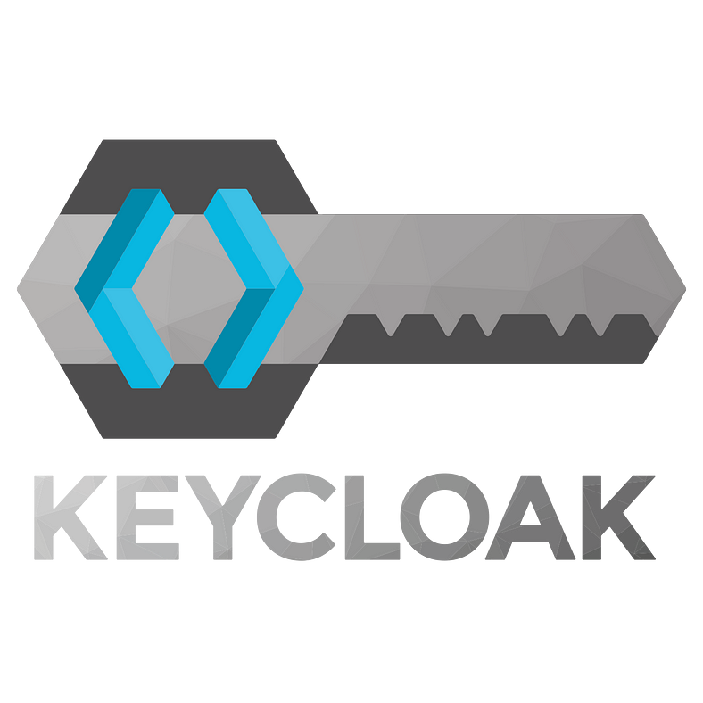

# Security & Compliance
1. **Falco** (CNCF Graduated)
2. **OPA** (CNCF Graduated)
3. **TUF** (CNCF Graduated)
4. **cert-manager** (CNCF Incubating)
5. **in-toto** (CNCF Incubating)
6. **Keycloak** (CNCF Incubating)  

 

### 1. **Falco** (CNCF Graduated)  
  

   - **설명**: Falco는 클라우드 네이티브 보안 도구로, 런타임 통찰력을 활용하여 클라우드, 컨테이너 및 kubernetes 워크로드에 대한 실시간 위협 탐지를 제공하는 오픈소스 프로젝트입니다. 
   - **문제 해결**: Falco는 의심스러운 활동을 신속하게 탐지하여 보안 침해 예방, 정책 적용으로 규정 준수 강화, 지속적 모니터링으로 시스템 안정성에 도움을 줍니다.
   - **특징**  
     - 실시간 모니터링 : Falco는 시스템 콜을 실시간으로 모니터링하여 컨테이너와 호스트에서 발생하는 모든 활동을 추적
     - 정책 기반 경고 : 사용자가 정의한 보안 정책에 따라 이상 행동을 탐지하고 경고를 생성. 이를 통해 보안 침해를 신속하게 식별 가능 
     - 다양한 데이터 소스 지원 : Kubernetes, Docker, Cloud Foundry 등 다양한 환경에서 데이터를 수집하고 모니터링 가능 
     - 확장성 : Falco는 다양한 플러그인과 통합할 수 있으며, 다른 보안 도구 및 로그 시스템과 연동 가능 
     - 사용자 정의 규칙 : 특정 요구 사항에 맞게 사용자 정의 규칙을 생성하여 특정 행동이나 이벤트에 대한 경고 설정 가능
   - **사용 사례**: Falco를 컨테이너, 쿠버네티스 및 클라우드를 위한 보안 카메라로 생각할 수 있습니다. 호스트, 컨테이너, 오케스트레이터 및 클라우드 로그에서 신호를 수집하고 의심스럽거나 비정상적인 동작을 보고합니다. Falco는 보안 이벤트를 감지하기 위한 커널 계측 메커니즘을 제공합니다. 그런 다음 노드, 컨테이너 런타임 및 쿠버네티스에서 가져온 메타데이터로 이를 보강합니다. 이 메타데이터는 컨테이너 이름, 이미지, 오케스트레이터 레이블, 오케스트레이터 리소스 유형 등을 기반으로 Falco 규칙을 동적으로 적용하는 데 사용됩니다. 
   - [Falco 문서](https://falco.org/)

### 2. **OPA** (CNCF Graduated)  
  

   - **설명**: Open Policy Agent(OPA, "오파"로 발음)는 스택 전체에서 정책 시행을 통합하는 오픈 소스 범용 정책 엔진입니다. OPA는 정책을 코드로 지정하고 간단한 API를 제공하여 소프트웨어에서 정책 의사 결정을 오프로드할 수 있는 고급 선언적 언어를 제공합니다. OPA를 사용하여 마이크로서비스, 쿠버네티스, CI/CD 파이프라인, API 게이트웨이 등에서 정책을 시행할 수 있습니다. 
   - **문제 해결**: 클라우드 네이티브 환경에서 정책을 코드로 지정함으로써 일관된 정책 적용, 복잡한 규칙 처리에 도움이 되며 분산된 환경에서도 정책을 중앙에서 관리할 수 있습니다. 
   - **특징**  
     - 정책 언어 Rego : OPA는 Rego라는 선언형 정책 언어를 사용하여 복잡한 정책 로직을 간결하게 표현하고 정의 가능
     - API 기반 : REST API를 통해 정책 결정을 제공하여, 애플리케이션이 OPA에 요청을 보내고 정책에 따른 허가 또는 거부 결정을 받을 수 있음
     - 유연한 통합 : Kubernetes, CI/CD 파이프라인, API 게이트웨이, 서비스 메시 등 다양한 환경과 쉽게 통합 가능
     - 정책 버전 관리 : 정책을 버전 관리하여 변경 이력을 추적하고 롤백할 수 있는 기능 제공
     - 관찰 가능성 : 정책 평가에 대한 로그를 기록하여 정책 적용 과정을 모니터링할 수 있음
   - **사용 사례**: OPA는 Kubernetes 클러스터에서 RBAC을 강화하여 더 복잡한 정책을 정의하고 적용할 수 있습니다. 또한 CI/CD 파이프라인에 통합되어 자동 정책 검사를 수행하거나, Istio와 같은 서비스 메시와 통합하여 서비스 간 통신에 대한 세밀한 정책을 적용합니다. 
   - [OPA 문서](https://www.openpolicyagent.org/docs/latest/)

### 3. **TUF** (CNCF Graduated)  
  

   - **설명**: TUF는 컨테이너 레지스트리, 패키지 저장소 등을 보호하여 시스템이 공격에 저항하고 안전하게 복구할 수 있는 오픈소스 프레임워크입니다. TUF는 보안 메커니즘과 툴링을 결합하여 Sigstore와 같은 다른 보안 프로젝트에서도 사용되는 강력한 신뢰 루트를 제공합니다. 통합하기 쉽고 관리하기 쉽습니다. 
   - **문제 해결**: TUF는 소프트웨어 업데이트 과정, 공급망 등에서 발생하는 위협에 대해 신뢰성 있는 SW 배포 지원, 방어 메커니즘 제공, 데이터 유출 및 손상 방지 등의 기능을 제공합니다. 
   - **특징**  
     - 다단계 서명 및 역할 : TUF는 여러 역할(예: 관리자, 배포자 등) 간의 권한을 분리하여, 특정 작업에 대한 접근을 제한. 이로 인해 각 역할에 대해 별도의 서명 절차를 요구
     - 서명된 메타데이터 : 모든 업데이트 메타데이터는 서명되어 있어, 수신자는 메타데이터의 진위를 확인할 수 있고, 이로 인해 중간자 공격 및 메타데이터 변조를 방지
     - 회복력 : TUF는 업데이트 서버가 공격받거나 오프라인 상태일 때도 업데이트를 계속 제공할 수 있도록 설계. (ex, 이전 버전의 메타데이터를 캐싱하여 사용자가 안전하게 소프트웨어를 업데이트할 수 있게 합니다.)
     - 자동 롤백 : 업데이트가 실패하거나 문제가 발생할 경우, TUF는 자동으로 이전 안전한 버전으로 롤백할 수 있는 기능을 제공  
   - **사용 사례**: 사용자에게 영향을 미치는 많은 유형의 키 및 저장소/레지스트리 손상을 방지하며 안전한 패키지 업데이르를 제공합니다. 손상에서 복구할 수 있는 안전한 방법을 제공합니다. 12년의 실무 경험, 약 12건의 보안 감사, 6건 정도의 심사를 거친 논문, 프로덕션에서 사용된 6건 정도의 구현, 수백만 개의 컨테이너 등이 보안되었습니다.
   - [TUF 문서](https://theupdateframework.io/overview/)

### 4. **cert-manager** (CNCF Incubating)  
  

   - **설명**: cert-manager는 Kubernetes 및 OpenShift 워크로드를 위한 강력하고 확장 가능한 X.509 인증서 컨트롤러입니다. 인기 있는 공개 발급자와 비공개 발급자 모두 다양한 발급자로부터 인증서를 얻고 인증서가 유효하고 최신 상태인지 확인하고 만료되기 전에 구성된 시간에 인증서를 갱신하려고 시도합니다.
   - **문제 해결**: cert-manager를 사용하여 TLS 인증서를 자동으로 관리함으로써 보안 수준을 높이고 안전항 통신을 보장합니다. 또한 수동의 번거로움을 덜어주고 자동화하여 운영 효율성을 높입니다. 인증서와 관련된 활동을 Kubernetes CRDs로 관리함으로써 관리가 용이해집니다. 
   - **특징**  
     - 자동 인증서 발급 : cert-manager는 Let’s Encrypt, HashiCorp Vault, AWS Certificate Manager 등 다양한 인증서 발급 서비스를 지원하여 자동으로 TLS 인증서를 발급 가능
     - 자동 갱신 : 발급된 인증서는 정해진 기간이 지나면 만료되기 때문에 cert-manager는 인증서를 자동으로 갱신
     - Kubernetes 리소스 통합 : cert-manager는 Kubernetes Custom Resource Definitions (CRDs)을 사용하여 인증서, 발급자, 인증서 서명 요청(Certificate Signing Request) 등을 관리
     - 유연한 정책 설정 : 다양한 인증서 발급 정책을 설정할 수 있어, 환경에 맞는 맞춤형 관리가 가능
   - **사용 사례**: 수동 인증서 관리란 발생을 기다리는 중단입니다. 잊어버린 갱신 한 번만 해도 전체 사이트가 다운됩니다. 따라서 자동화는 안정성의 핵심이며, cert-manager는 Kubernetes에서 이를 달성하기 위한 가장 중요한 도구입니다. 또한 서비스 메시와 같은 워크로드에는 로컬 인증 기관이 필요할 수 있으며, cert-manager는 인프라의 이러한 핵심 부분을 발급하고 제어하는 데 도움이 될 수 있습니다.
   - [cert-manager 문서](https://cert-manager.io/docs/)

### 5. **in-toto** (CNCF Incubating)  
  

   - **설명**: in-toto는 소프트웨어 공급망에 보안을 제공합니다. 소프트웨어를 만들 때 발생하는 빌드, 버전 제어, 테스트, 배포, 종속성 등의 작업을 암호화하여 누가, 어떤 단계를, 어떤 순서로 수행되었는지 추적하고 검증할 수 있습니다. in-toto는 또한 이러한 작업에 대한 정책을 시행하여 공급망이 설명한 대로 수행되도록 할 수 있습니다.
   - **문제 해결**: 소프트웨어 공급망 전반을 추적하여 변경 사항을 실시간으로 탐지 및 방지할 수 있습니다. 또한 공급망을 추적하고 기록하기 때문에 문제 발생 시 원인을 찾는 데 도움을 줍니다. 또한 각 단계에서 소프트웨어가 정확하게 빌드, 테스트 되었는지 검증이 가능합니다.
   - **특징**  
     - 공급망 전체 추적 : in-toto는 소프트웨어 공급망에서 발생하는 모든 단계를 기록하고 추적합니다. 빌드, 테스트, 패키징 등 모든 활동을 투명하게 관리하여 각 단계의 무결성을 확인 가능
     - 정책 기반 검증 : in-toto는 개발 및 배포 과정에서 발생하는 각 단계가 사전에 정의된 정책에 따라 실행되었는지 검증. 이로 인해 예상치 못한 변경이나 위반 사항을 탐지 가능
     - 서명된 메타데이터 : 각 단계에서 생성된 메타데이터는 서명되어, 변경이 발생하지 않았음을 보장. 이를 통해 누군가가 악의적으로 공급망의 데이터나 코드를 변조하는 것을 방지
     - 프레임워크의 유연성 : in-toto는 소프트웨어 파이프라인의 모든 요소와 유연하게 통합될 수 있어, 특정 도구나 환경에 종속되지 않음. 다양한 빌드 시스템 및 CI/CD 파이프라인과 호환
     - 위협 모델 방지: in-toto는 소프트웨어 공급망에서 발생할 수 있는 다양한 위협 모델(예: 빌드 중 악성 코드 주입, 배포 시 코드 변조 등)을 사전에 정의하고 이에 맞는 보호 메커니즘을 제공
   - **사용 사례**: 소프트웨어 공급망의 많은 손상이 사용자에게 영향을 미치지 않도록 방지합니다. 또한 추적성을 제공하여 문제가 발생했을 때 무슨 일이 일어났는지 확인할 수 있습니다. 
   - [in-toto 문서](https://in-toto.io/in-toto/)

### 6. **Keycloak** (CNCF Incubating)  
  

   - **설명**: Keycloak은 최신 애플리케이션과 서비스를 위한 오픈소스 ID 및 액세스 관리(IAM) 솔루션입니다. 주로 개발자가 최소한의 노력으로 애플리케이션을 쉽게 보호할 수 있도록 설계되었으며, OAuth2, OpenID Connect, WebAuthn을 지원하는 업계 보안 표준 프로토콜을 기반으로 구축됩니다.
   - **문제 해결**: 애플리케이션과 서비스에 대해 인증과 인가를 쉽게 관리할  수 있도록 지원합니다. 별도로 구현할 필요가 없어 관리 복잡성이 감소될뿐만 아니라,. 기존 인프라와 통합이 가능하고, 강력한 인증 및 사용자 관리가 가능합니다.
   - **특징**  
     - 친숙한 인터페이스 : 관리자와 사용자에게 Keycloak을 구성하고 관리하기 위한 광범위하고 친숙한 인터페이스를 제공
     - 기존 인프라 통합 : SAML2 기반 IdP, LDAP 서버, Kerberos/SPNEGO, 사용자 지정 사용자 스토리지 솔루션과 같은 기존 보안 인프라는 통합하기 쉽고 애플리케이션과 최종 사용자에게 투명하게 제공
     - 노코딩 기반 : 완벽하게 사용자 지정 가능한 로그인 페이지, 강력한 인증, 비밀번호 복구 지원, 클라이언트 비밀 로테이션, 2FA 복구 코드, 약관, 단계별 인증 등을 제공. 코딩 필요 없이 가능
     - 확장성 : 사용자에게 표시되는 모든 페이지는 사용자 지정 테마를 지원하므로 페이지의 모양과 느낌을 수정하여 회사 브랜딩 및 기존 애플리케이션과 통합 가능   
   - **사용 사례**: Keycloak은 내장된 클라우드 네이티브 ID 및 액세스 제어 표준을 제공합니다. 애플리케이션의 보안 측면을 Keycloak에 위임함으로써 개발자는 다양한 인증 메커니즘에 대해 걱정하거나 암호화에 대해 이해하거나 비밀번호를 안전하게 저장하는 방법에 대해 걱정할 필요가 없습니다. 개발자는 OAuth2, OpenID Connect, WebAuthn, SAML2 기반 IDP, LDAP 서버, Kerberos/SPNEGO와 같은 최신 인증 및 권한 부여 프로토콜을 활용할 수 있습니다. Keycloak은 인프라 팀과 클라우드 네이티브 개발자가 통합된 보안 표준을 통해 클라우드 네이티브 스택 기술을 보호하여 사용자에게 사용성, 확장성 및 보안에 중점을 둔 클라우드 친화적인 경험을 제공할 수 있도록 합니다.
   - [keycloak 문서](https://www.keycloak.org/)

