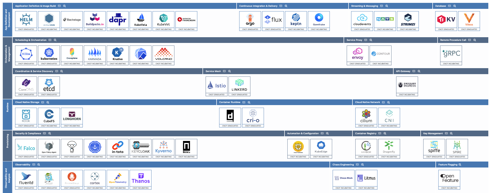

# cncf
Cloud Native Landscape  

## Cloud Native Landscape란?
CNCF(Cloud Native Computing Foundation)에서 제공하는 것으로 다양한 카테고리와 수많은 기술들이 나열되어 있습니다.  
모든 오픈 소스 프로젝트와 상용 제품들을 카테고리로 나누어 정리하고, 현재의 생태계에 대한 개요를 제공하는 것입니다.  

CNCF (Cloud Native Computing Foundation)의 Landscape에서 "Graduated" 및 "Incubating" 단계의 프로젝트들에 대해서 살펴보려고 합니다.
 

### Graduated Projects (졸업 프로젝트)
- CNCF에서 졸업한 프로젝트는 신뢰성과 성숙도가 입증된 오픈소스 프로젝트로, 클라우드 네이티브 생태계에서 널리 사용되는 기술들입니다.  
- 이러한 프로젝트들은 수년간의 개발과 유지보수를 통해 견고한 커뮤니티와 상용 지원을 확보했으며, 성능, 보안, 유연성 측면에서 검증되었습니다.  
- 예시로는 Kubernetes, Prometheus, Envoy 등이 있습니다. 이들은 기업 및 커뮤니티에서 폭넓게 사용되고 있으며, 클라우드 네이티브 애플리케이션 배포와 운영에 핵심적인 역할을 합니다.  

### Incubating Projects (인큐베이팅 프로젝트)  
- 인큐베이팅 단계에 있는 프로젝트들은 아직 완전히 성숙하지 않았지만, CNCF에서 잠재력을 인정받아 지원을 받는 프로젝트들입니다.  
- 이 단계에서는 프로젝트가 사용자와 기여자를 더 많이 확보하고 기술적 성숙도를 높이는 과정에 있으며, 커뮤니티와 생태계 내에서 점점 더 중요한 역할을 하게 됩니다.  
- 대표적인 예로는 Argo, Flux, OpenTelemetry 등이 있습니다. 이러한 프로젝트들은 아직 졸업하지 않았지만, 클라우드 네이티브 워크로드를 지원하는 데 중요한 도구들로 인정받고 있습니다.  

  

해당 이미지는 CNCF 에서 "Graduated" 및 "Incubating" 단계를 부여받은 프로젝트 입니다.  

CNCF Landscape는 다양한 기능을 제공하는 프로젝트들로 구성되어 있으며, 아래와 같이 5개의 대분류와 그 하위의 20개의 중분류로 나눌 수 있습니다.

## 1. Application Definition & Image Build
### App Definition and Development: Kubernetes 애플리케이션 정의 및 개발을 위한 도구
- Helm, Artifact Hub, Backstage, Buildpacks.io, Dapr, KubeVela, KubeVirt, Operator Framework
 

## 2. Orchestration & Management
### Scheduling & Orchestration: 애플리케이션의 스케줄링 및 오케스트레이션을 담당하는 도구
- KEDA, Kubernetes, Crossplane, Karmada, Knative, Volcano
### Service Mesh: 마이크로서비스 간의 네트워크 트래픽을 관리하는 도구
- Istio, Linkerd
### Coordination & Service Discovery: 클러스터 내 서비스의 발견 및 조정 기능을 제공하는 도구
- CoreDNS, etcd
### Remote Procedure Call (RPC): 네트워크 통신을 위한 원격 프로시저 호출 기능을 제공하는 도구
- gRPC
### Service Proxy: 네트워크 트래픽을 처리하는 프록시 서버 도구
- Envoy, Contour
### API Gateway: API 게이트웨이 역할을 하는 도구
- Emissary Ingress
 

## 3. Runtime
### Cloud Native Storage: 클라우드 네이티브 환경에서의 스토리지 관리 도구
- Rook, CubeFS, Longhorn
### Container Runtime: 컨테이너를 실행하는 런타임 환경을 제공하는 도구
- containerd, CRI-O
### Cloud Native Network: 네트워크 통신을 관리하는 도구
- Cilium, CNI
 

## 4. Provisioning
### Security & Compliance: 클라우드 네이티브 환경에서 보안 및 컴플라이언스를 관리하는 도구
- Falco, Open Policy Agent (OPA), The Update Framework (TUF), in-toto, Kyverno, Keycloak
### Automation & Configuration: 자동화 및 설정 관리를 위한 도구
- Cloud Custodian, KubeEdge
### Container Registry: 컨테이너 이미지를 관리하는 레지스트리
- Harbor, Dragonfly
### Key Management: 키 관리와 관련된 도구
- SPIFFE, SPIRE
 

## 5.Observability & Analysis
### Observability: 클러스터와 애플리케이션의 상태를 모니터링하고 분석하는 도구
- Fluentd, Jaeger, Prometheus, Cortex, OpenTelemetry, Thanos
### Chaos Engineering: 카오스 엔지니어링을 통해 시스템 복원력을 테스트하는 도구
- Chaos Mesh, Litmus
### Feature Flagging: 피처 플래깅을 위한 도구
- OpenFeature