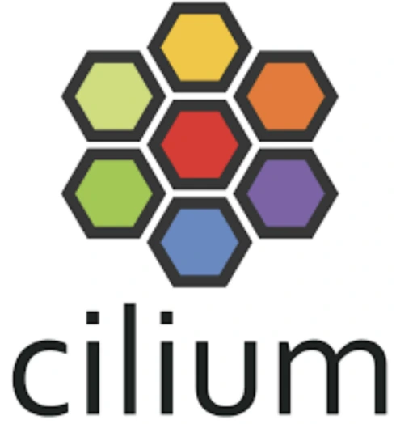

# Cloud Native Network  
 

1. **Cilium** (CNCF Graduated)
2. **CNI** (CNCF Graduated)

 
 

# Cloud Native Network     

### 1. **Cilium** (CNCF Graduated)  
  

   - **설명**: Cilium은 클라우드 네이티브 환경에서 네트워크와 보안을 투명하게 관리하는 오픈소스 네트워킹 솔루션입니다. Linux 커널의 eBPF(Extended Berkeley Packet Filter)를 활용하여 네트워크 트래픽을 처리하고, 세밀한 보안 정책을 제공합니다.  
   - **문제 해결**: Cilium은 IP 주소 대신 서비스 및 컨테이너 ID를 기반으로 보안 정책을 적용하여, 변화하는 환경에서도 안정적으로 보안을 관리합니다.  
   - **특징**  
     - eBPF 기반 네트워킹: Cilium은 eBPF를 활용하여 Linux 커널 수준에서 네트워크 트래픽을 처리하고, 고성능 네트워킹과 보안 정책을 구현  
     - 서비스 메시 통합: Cilium은 Istio와 같은 서비스 메시와 통합하여 네트워크 보안 정책 강화  
     - 고성능 및 확장성: Cilium은 마이크로서비스 간의 네트워크 성능을 저하시키지 않고 확장 가능  
   - **사용 사례**: Cilium은 Kubernetes 환경에서 마이크로서비스 간의 통신과 보안을 효과적으로 관리하고, 네트워크 가시성 및 성능을 강화하는 데 사용됩니다.  
   - [Cilium 문서](https://docs.cilium.io/en/stable/index.html)  
 

### 2. **CNI** (CNCF Graduated)  
  

   - **설명**: CNI(Container Network Interface)는 Kubernetes와 같은 컨테이너 오케스트레이션 시스템에서 네트워킹을 제공하기 위한 표준 인터페이스입니다. CNI는 컨테이너 네트워크 설정 및 관리 작업을 간단하게 처리하며, 다양한 네트워크 플러그인과 통합될 수 있습니다.  
   - **문제 해결**: 컨테이너 기반 애플리케이션에서는 네트워킹 설정이 복잡해질 수 있습니다. CNI는 이러한 복잡성을 줄이고, 다양한 네트워크 플러그인을 Kubernetes와 쉽게 통합할 수 있게 합니다.  
   - **특징**  
     - 유연한 네트워크 플러그인 통합: CNI는 다양한 네트워크 플러그인(Calico, Weave, Flannel 등)을 지원  
     - 모듈식 아키텍처: 네트워크와 관련된 다양한 작업(예: IP 주소 할당, 라우팅 설정)을 모듈식으로 처리하여 유연한 네트워킹 설정 가능  
     - Kubernetes 네이티브: Kubernetes와 완벽하게 통합되어, 클러스터 내에서 컨테이너 네트워크 설정 자동화
   - **사용 사례**: CNI는 Kubernetes 클러스터에서 네트워킹을 설정하고 관리하는 데 필수적인 도구로, 다양한 네트워크 환경에서 유연하고 확장 가능한 네트워크 설정을 제공합니다.  
   - [CNI 문서](https://www.cni.dev/)  
 