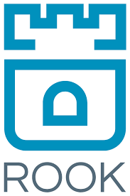
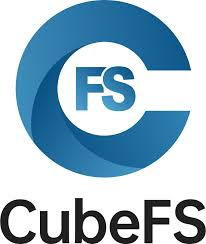

# Cloud Native Storage 
 

1. **Rook** (CNCF Graduated)
2. **CubeFS** (CNCF Incubating)
3. **Longhorn** (CNCF Incubating)

 
 

# Cloud Native Storage      

### 1. **Rook** (CNCF Graduated)  
  

   - **설명**: Rook는 클라우드 네이티브 환경에서 분산 스토리지 시스템을 관리하는 오픈소스 스토리지 오케스트레이터입니다. Kubernetes 상에서 클러스터 파일 시스템, 블록 스토리지, 오브젝트 스토리지를 자동으로 배포하고 관리할 수 있도록 지원합니다.  
   - **문제 해결**: 분산 스토리지 시스템의 배포와 관리를 자동화하여, 클라우드 네이티브 환경에서 스토리지 관리의 복잡성을 줄입니다.  
   - **특징**  
     - 다양한 스토리지 유형 지원: Rook는 블록, 파일, 오브젝트 스토리지를 지원하여 유연한 스토리지 배포 가능  
     - Kubernetes와의 통합: Kubernetes 환경에서 스토리지를 자동으로 배포하고, 확장 및 관리 작업을 지원  
     - 자체 복구 기능: Rook는 장애 발생 시 자동으로 스토리지를 복구하며, 고가용성 제공  
   - **사용 사례**: Rook는 Kubernetes 클러스터에서 클라우드 네이티브 애플리케이션을 위한 스토리지 관리에 적합하며, 다양한 스토리지 요구를 충족하는 대규모 분산 스토리지 솔루션을 필요로 하는 환경에서 사용됩니다.  
   - [Rook 문서](https://rook.io/docs/rook/v1.12/Getting-Started/intro/)  
 

### 2. **CubeFS** (CNCF Incubating)  
  

   - **설명**: CubeFS는 클라우드 네이티브 환경에서 확장성과 높은 성능을 제공하는 분산 파일 시스템입니다. 다양한 데이터 접근 프로토콜(S3, POSIX, HDFS)을 지원하며, Kubernetes에 쉽게 통합 및 관리할 수 있도록 설계된 파일 스토리지 솔루션입니다.  
   - **문제 해결**: 대규모 분산 환경에서 데이터 저장 및 관리를 단순화하고, 클라우드 네이티브 워크로드에서 효율적인 파일 스토리지를 제공합니다.  
   - **특징**  
     - 높은 확장성: CubeFS는 PB 및 EB 수준으로 스토리지 확장이 가능하며, 성능 저하 없이 대규모 데이터 저장소로 확장 가능  
     - Kubernetes 통합: Kubernetes 클러스터에 CubeFS를 배포하고 관리할 수 있으며, 클라우드 네이티브 환경에 최적화  
     - 다양한 프로토콜 지원: CubeFS는 S3, POSIX, HDFS와 호환되며, 프로토콜 간의 상호 운용성 제공  
     - 데이터 일관성 보장: 멀티 레벨 캐싱과 강력한 복제 프로토콜을 통해 데이터의 강력한 일관성을 보장  
   - **사용 사례**: CubeFS는 대규모 데이터 저장과 처리가 필요한 클라우드 네이티브 워크로드에서 사용되며, 파일 기반 애플리케이션 및 빅데이터 처리 시스템에 적합합니다.  
   - [CubeFS 문서](https://cubefs.io/docs/master/overview/introduction.html)  
 

### 3. **Longhorn** (CNCF Incubating)  
  

   - **설명**: Longhorn는 Kubernetes 환경에서 사용하기 쉬운 경량 분산 블록 스토리지 시스템입니다. 오픈소스 프로젝트로, 데이터를 안전하게 복제하고 백업할 수 있는 기능을 제공합니다.   
   - **문제 해결**: 클라우드 네이티브 환경에서 복잡한 스토리지 관리 문제를 간소화하여 블록 스토리지를 쉽게 운영하고, 데이터를 보호하며 복구할 수 있도록 지원합니다.  
   - **특징**  
     - 분산 블록 스토리지: Longhorn는 각 스토리지 볼륨을 분산된 형태로 복제하며, 데이터 손실을 방지  
     - 자동화된 백업 및 복구: 백업을 NFS 또는 AWS S3와 같은 외부 저장소에 저장하고, 스냅샷을 주기적으로 생성하여 데이터 보호  
     - Kubernetes 네이티브 통합: Longhorn는 Kubernetes와 완벽히 통합되어, Persistent Volume(PV)과 Persistent Volume Claim(PVC)을 통해 쉽게 배포 및 관리 가능  
     - 다중 복제 및 스케줄링: 각 볼륨의 복제본 수를 설정하고, 여러 노드에 복제본을 스케줄링하여 고가용성 보장
  
   - **사용 사례**: Longhorn는 데이터 보호 및 복구가 중요한 Kubernetes 클러스터에서 사용되며, 클라우드 네이티브 애플리케이션의 분산 블록 스토리지를 관리하는 데 적합합니다.  
   - [Longhorn 문서](https://longhorn.io/docs/1.7.1/what-is-longhorn)   
 